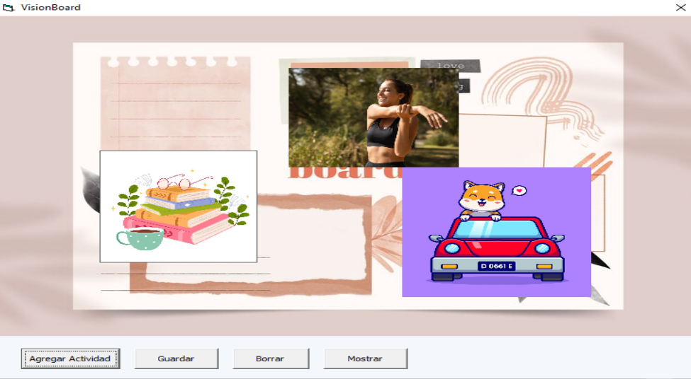

# Vision Board 2025

### Autor: Agustín Aguilar Eusebio
Fecha: 24/12/2024

### Descripción:
Con la finalidad de afinar habilidades y conocimiento en vb6 se realizará un proyecto sencillo en el cuál el usuario podrá guardar sus objetivos o propósitos de año nuevo en un programa de vb6. El programa será capaz de agregar propósitos agregando una imagen alusiva, un título de la actividad, una descripción, una categoría y una fecha, se podrá ver el detalle.
Mi programa lo que hace diferente de otros es que guarda las posiciones de las imágenes y sus dimensiones, además de tener la posibilidad de acomodar la imagen en cualquier lugar del formulario principal y cambiar el tamaño. Se debe utilizar base de datos.

### Detalles técnicos:
- Visual Basic 6
- Sql Server 2022
- SQL server referencia en vb6

### ¿Cómo hacerlo funcionar?
Solo hay que descargar el código del repositorio, claro que hay que tener instalado el vb6, sql server 2022 y tener una base de datos; se utilizan dos tablas: propositos y categorias_propositos

```
CREATE TABLE [dbo].[propositos](
	[id] [int] IDENTITY(0,1) NOT NULL,
	[fecha] [date] NULL,
	[titulo] [nvarchar](50) NULL,
	[descripcion] [nvarchar](255) NULL,
	[categoria] [tinyint] NULL,
	[local_path] [nvarchar](255) NULL,
	[is_new] [bit] NULL,
	[img_width] [int] NULL,
	[img_height] [int] NULL,
	[img_top] [int] NULL,
	[img_left] [int] NULL)
```

```
CREATE TABLE [dbo].[categorias_proposito](
	[id] [int] IDENTITY(0,1) NOT NULL,
	[descripcion] [nvarchar](50) NULL)
```

Hay que agregar unas categorías y cambiar la cadena de conexión para la base de datos que estés utilizando.

Crear un archivo txt con nombre “connection_string.txt” y allí hay que poner la cadena de conexión.


### Capturas:

Puedes seleccionar las imágenes y moverlas con WASD, puedes cambiar las dimensiones con YUHJ


Ventana para agregar actividad

Al agregarla:



Después de re dimensionar y volver a posicionar:


Hay tooltip


Mostrar se ve así:


### Retrospectiva del sprint:
Me gustó la idea de hacer un proyecto nuevo desde cero, aunque sencillo, práctico y acorde a la época del año, me gustó ya que pude reforzar algunas cosas de vb y bases de datos, además de nutrir mi imaginación. Estuvo bien que fuera sencillo por lo mismo que ya estamos más ocupados con el trabajo, pero se agradece la intención.

### Propósito de año nuevo:
Quiero mejorar en mi persona, mejorar mi desempeño en mi trabajo, mis habilidades sociales, mi estabilidad emocional, pasar tiempo con mis seres queridos y tener un carro tal vez.

### Una reflexión de este año:
Siento que he tenido un gran apoyo de mis seres queridos y gran avance sobre mi persona a lo largo del año, obvio con mis momentos de bajón y malas rachas, pero siento que han mejorado más aspectos de mi vida de los que han empeorado.
